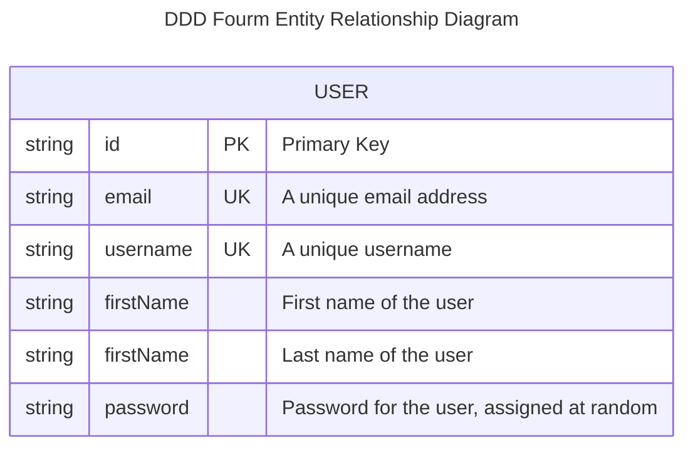

```mermaid
---
title: DDD Fourm Entity Relationship Diagram
---
erDiagram
    USER {
        string id PK "Primary Key"
        string email UK "A unique email address"
        string username UK "A unique username"
        string firstName "First name of the user"
        string firstName "Last name of the user"
        string password "Password for the user, assigned at random"
    } 
    

```
